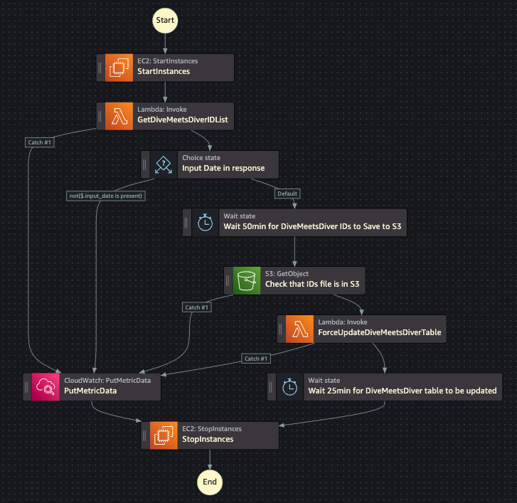

# update-divemeets-diver-table

Since not all divers on DiveMeets will have Adrenaline profiles, we have to parse all the DiveMeets profiles to determine which divers are high-school age and would be the target audience for college coaches in our Rankings view.

## State Machine Diagram

## The Process

We obtain this information through the following process:

0. EventBridge Schedule is set to run this process every Wednesday at 9AM ET (UTC-5) so we can capture any newly created DiveMeets accounts in the relevant age ranges, as well as update existing divers' skill ratings from any meets they competed in over the last week.
1. The `UpdateDiveMeetsDiverTable` Step Function starts up an existing EC2 instance to run the processing jobs.
2. The step function then invokes the `GetDiveMeetsDiverIDList` Lambda function to send a bash script to this instance to kick off the processing. It passes the hard-coded JSON input `{"start_index": "25000", "end_index": '150000"}` to the first Python function within the script.
    1. Note that the start and end indices are passed as Strings, not Ints.
3. If the lambda sends the command successfully, it returns a dictionary like this: `{"input_date": "yyyy-MM-dd"}`, where the value is the current date in EST (UTC-5) to be passed to the next step in the step function. If the lambda fails to send the command after 5 retries, it sends an empty dictionary, at which point the step function will fail and stop the EC2 instance.
4. The step function then waits 45 minutes while the first stage of processing is executed.
    1. The script copies the main script (`s3://adrenalinexxxxx153503-main/public/update-divemeets-diver-table/script.py`) to execute in the first stage of processing.
    2. A virtual environment is set up on the instance, and the required depdencies are installed.
    3. An initial script is executed to parse all the DiveMeets profiles within the ID range 25,000-150,000, and the relevant IDs are recorded in `ids.csv`.
        1. This is done by determining if the profile's FINA age (if present) is between 14 and 18, and if it is not present, if their high school graduation year (if present) is between 2024 and 2028 (TODO: make years range dynamic)
        2. If neither field is present in the profile, it is ignored.
    4. After the Python script finishes, the `ids.csv` output file is copied to S3 to the `s3://adrenalinexxxxx153503-main/public/update-divemeets-diver-table/divemeets-divers-lists/` prefix with `yyyy-MM-dd.csv` as the filename *(`e.g. s3://adrenalinexxxxx153503-main/public/update-divemeets-diver-table/divemeets-divers-lists/2023-11-30.csv`)*
    5. Once all the DiveMeets IDs have been processed and the script finishes, it deactivates the virtual environment, and deletes all the files it created.
5. The step function runs an S3 GetObject request using the `"input_date"` to see if the current date's IDs file was written to the bucket. If it fails to find the key, it stops the instance and completes. Otherwise, it continues.
6. The step function then invokes the `ForceUpdateDiveMeetsDiverTable` Lambda function to send a bash script to the same EC2 instance to handle the DynamoDB update job. It passes the hard-coded JSON input `{"input_date": "yyyy-MM-dd"}` to the Python function within the script.
7. The step function then waits 25 minutes while the second stage of processing is executed.
    1. The second stage replicates the `ProfileParser` and `SkillRating` classes in Swift to parse the DiveMeets profile and collect the personal information at the top, as well as the Dive Statistics table.
    2. Before processing any IDs, the script first runs scan operations on the NewUser DynamoDB table and checks if any of the IDs in the input list are already associated with Adrenaline profiles. If yes, these IDs are filtered out of the list before any processing occurs, since they will be processed separately as Adrenaline profiles.
    3. Once the list is filtered, the script begins parsing DiveMeets profiles in parallel by ID.
    4. After parsing the profile, the script verifies that the profile contains personal information, specifically gender, as well as the statistics table. If any of these are not present, the ID is skipped.
    5. After verifying the presence of this data, the script calculates the diver's skill rating with the parsed statistics table.
    6. After getting the skill rating, an analogous DiveMeetsDiver Python object is created to package the relevant data for writing to DynamoDB.
    7. This object is then passed to a custom GraphQLClient, which handles creating or updating the record using HTTP POST requests to a GraphQL endpoint provided by AppSync.
    8. Once all the relevant DiveMeets IDs have been processed and the script finishes, it deactivates the virtual environment, and deletes all the files it created.

Once these records are added to DynamoDB, Adrenaline is able to sync with the table through AppSync and DataStore so the records can be displayed to the user in the Rankings view.
This process also shouldn't interfere with anyone using the app during this process, as AppSync should take care of pushing any DynamoDB updates to the user, and the rest of the process has no user impact.

## Logging

There are several sets of logs for this process: the GetDiveMeetsDiverIDList lambda logs (`/aws/lambda/GetDiveMeetsDiverIDList`), the ForceUpdateDiveMeetsDiverTable lambda logs (`/aws/lambda/ForceUpdateDiveMeetsDiverTable`), the EC2 logs, and the step function logs. Since the step function and lambdas are just initiating these processes, the logs here are minimal. The EC2 logs are much more descriptive of the actual process. This is in the `/aws/ec2/update-divemeets-diver-table` log group.

There are four types of log streams that could appear in this log group

- `.../.../aws-runShellScript/stdout`
  - This is the output of the bash script when it is starting, between Python scripts, and finishing the run.
- `.../.../aws-runShellScript/stderr`
  - This receives output when either script attempts to clean up resources that were left behind by a failed run, but couldn't find any. It also catches any other errors in the script run, if any occur.
- `python-script-logs-...`
  - This is the log stream for the initial Python script that scrapes the DiveMeets IDs in the proper age range. This script takes about 40 minutes to run.
- `python-dynamodb-script-logs-...`
  - This is the log stream for the second Python script that reads ids.csv and processes them to be written to DynamoDB. This script takes about 20 minutes to run.

## Alarms

[This](https://us-east-1.console.aws.amazon.com/cloudwatch/home?region=us-east-1#metricsV2?graph=~(view~'timeSeries~stacked~false~metrics~(~(~'UpdateDiveMeetsDiverTable~'StateMachineFailures))~region~'us-east-1)&query=~'*7bUpdateDiveMeetsDiverTable*7d) metric tracks the state machine executions. If the state machine fails to get an expected result at any stage of the step function, it sends a metric datapoint with value 1.0, which triggers [this](https://us-east-1.console.aws.amazon.com/cloudwatch/home?region=us-east-1#alarmsV2:alarm/UpdateDiveMeetsDiverTable+StateMachineFailure?) alarm and sends an email to our @adren.tech emails. If it succeeds, then it sends a datapoint with value 0.0, which keeps the alarm in OK state.

*Note: the successful metric is sent from within the second Lambda script, since there have been past executions before the redesign where the second script would hang. Sending the metric at the end of the execution inside the bash script helps us track whether the execution was completed, or if the EC2 instance was stopped while the script was hanging.*
